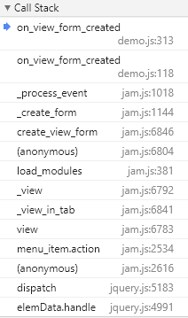

[< Data aware](data_aware.md) | [Table of content](index.md)

# Forms

There are four types of forms: 
- `view forms`, 
- `edit forms`, 
- `filter forms`, 
- `param forms`.

These item attributes are JQuery objects:

```javascript
  task.invoices.view_form
  task.invoices.edit_form
  task.invoices.filter_form
  task.purchases_report.param_form
```

You can use JQuery to access any JQuery object in the form

```javascript
  > // Find and hide new button on the invoices view form
  > task.invoices.view_form.find('#new-btn').hide()

  > // Find ok button on the invoices edit form
  > task.invoices.edit_form.find('#ok-btn')

  > // Find taxrate input line  and change color attribute
  > task.invoices.edit$('input.taxrate').css('color', 'red')

  > // Find tax input line and change color attribute
  > task.invoices.edit_form.find('.dbtable td.tax').css('color', 'red')
```

You can assign jQuery events to buttons or other form elements. This is usually done in form events.

### Jam.py templates

Jam.py `forms` are based on `html` templates. These templates are defined in the `index.html` file, in the `div` with the class `"templates"`. When task is loaded it cuts out this `div` and stores it as templates task attribute.

```javascript
  > task.templates
```

Forms are created using the `create_(type)_form` methods, where `type` is the type of 
the form. These methods are used internally by the following methods: `view`,  
`insert_record`, `append_record`, `edit_record`.

The application reads the `form` template from the `templates` attribute of the `task` and, if the `container` parameter is passed, inserts it into the `container`, otherwise a `modal form` is created and the `template` is inserted into it.

The application first looks for a template with a `formname-type` class, where `formname` is the `item_name` attribute of the form, and `type` is the form type.

Form example:

```javascript
  customers-view
```

If the template is not found, it looks for the `owner` template, and after that the `default` template.

Items have `type_options` attributes, where type is a form type that specifies the attributes of the form to create. For more information on `form options`, see the documentation.

```javascript
  > task.invoices.view_options
  {title: "Invoices", fields: Array(9), form_header: true, form_border: true, close_button: true,...}

  > task.invoices.edit_options
  {title: "Invoices", fields: Array(0), form_header: true, form_border: true, close_button: true,...}
```

### Form events

The first event triggered on the client, after the task is loaded, is the `on_page_loaded` event. In the demo application this event is used to create a dynamic menu, based on the `task tree`. For each visible item, clicking on the menu will trigger JQuery event to view or print the item.

To keep track of the event as accurately as possible, we set a breakpoint in the source code of the task client module in the `on_view_form_created` event handler of the `Customers` item [^1]:


To understand the order of events, let's look at the stack of function calls [^2]:



Apparently the `on_view_form_created` event handler was called by the `_process_event` 
function. This function calls three `on_view_form_created` event handlers: 

* One for the `task`, if defined in the `task` client module, 
* Second for the `item's owner`, if defined in the `group` client module,
* and finally thrid for the `item`, if defined in the `item` client module,

```javascript
  // Part of the _process_event function code
  
  if (this.task[event]) {
    if (this.task[event].call(this, this)) return;
  }
  
  if (!this.master && this.owner[event]) {
    if (this.owner[event].call(this, this)) return;
  }

  if (this[event]) {
    if (this[event].call(this, this)) return;
  }
```

following the task tree structure. 

This way, you can place your code in the `task` client module, and it will apply to all 
other modules, as the author of Jam.py does, or to the `client` module of a `group`, so it will apply to all `group` items, and you can write code for each `item`. All of them will be executed, and the result will be the product of all written.

In the same way, events are generated for other types of forms, with the exception of 
the `close_query` events, they are triggered in the reverse order.

**Footnotes**

[1]: The code of the Jam.py framework has changed a lot since the time of recording 
the corresponding video. So we will show the essence in a slightly different way.

[2]: Hierarchical event processing is what distinguishes Jam.py most, contributes to 
the small size of the code and some kind of inheritance behavior.

[< Data aware](data_aware.md) | [Table of content](index.md)
