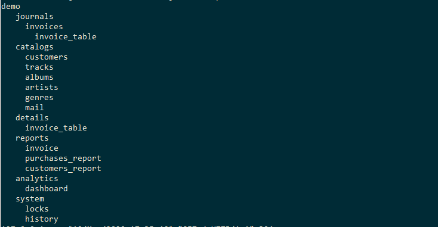
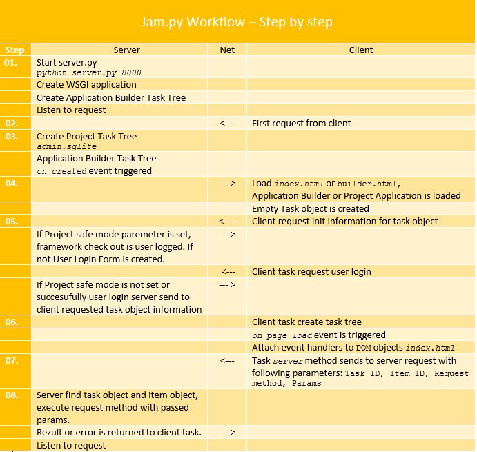

[< Getting started](getting_started.md) | [Table of content](index.md) | [Client server interaction >](client-server.md)

# The task tree

Jam.py `server` application creates a `server task`, containing a `task tree`, based on the information in the `admin.sqlite` database, which stores the project structure and code created by developer in the [appbuilder page](http://localhost:8080/builder.html). 

### The client task

When the browser loads `jam.js` library it creates an empty `client task` object. After the document is loaded the `client task` loads itself from the `server task` object.

If we run the Demo application and open the browser web console, and enter:

```javascript
  > task
  > Task {owner: undefined, item_name: 'demo', item_caption: 'Jam.py demo', visible: null, ID: 1, ...}
```

The `task` object, on the client, is a `global` object and is available in all client modules. 

It represents a `tree`. Each `item` of the `tree` can `own` other `items`:

```javascript

  > task.items
    (6) [Group, Group, Group, Group, Group, Group]
    0: Group {owner: Task, item_name: 'journals', item_caption: 'Journals', visible: true, ID: 3, ...}
    1: Group {owner: Task, item_name: 'catalogs', item_caption: 'Catalogs', visible: true, ID: 2, ...}
    2: Group {owner: Task, item_name: 'details', item_caption: 'Details', visible: false, ID: 4, ...}
    3: Group {owner: Task, item_name: 'reports', item_caption: 'Reports', visible: true, ID: 5, ...}
    4: Group {owner: Task, item_name: 'analytics', item_caption: 'Analytics', visible: true, ID: 23, ...}
    5: Group {owner: Task, item_name: 'system', item_caption: 'System', visible: false, ID: 26, ...}
    length: 6
    __proto__: Array(0)
```

and so on recursively:

```javascript
  > task.items[1].items

    (6) [Item, Item, Item, Item, Item, Item]
    0: Item {owner: Group, item_name: 'customers', item_caption: 'Customers', visible: true, ID: 10, ...}
    1: Item {owner: Group, item_name: 'tracks', item_caption: 'Tracks', visible: true, ID: 15, ...}
    2: Item {owner: Group, item_name: 'albums', item_caption: 'Albums', visible: true, ID: 12, ...}
    3: Item {owner: Group, item_name: 'artists', item_caption: 'Artists', visible: true, ID: 11, ...}
    4: Item {owner: Group, item_name: 'genres', item_caption: 'Genres', visible: true, ID: 13, ...}
    5: Item {owner: Group, item_name: 'mail', item_caption: 'Mail', visible: false, ID: 25, ...}
    length: 6
    __proto__: Array(0)
```

All `items` are derived from the common ancestor class - `AbstractItem`.  

Each item is an attribute of its owner. 

```javascript
  > task
  Task {owner: undefined, item_name: "demo", item_caption: "Jam.py demo", visible: null, ID: 1, ...}

  > task.catalogs
  Group {owner: Task, item_name: "catalogs", item_caption: "Catalogs", visible: true, ID: 2, ...}

  > task.catalogs.customers
  Item {owner: Group, item_name: "customers", item_caption: "Customers", visible: true, ID: 10, ...}
```

`Items` that are owned by `Groups` are also attributes of the `Task` - they must to have unique names.

```javascript
  > task.customers
  Item {owner: Group, item_name: "customers", item_caption: "Customers", visible: true, ID: 10, ...}
```

To get the `owner` of `item`, use its `owner` attribute. 

```javascript
  > task.customers.owner
  Group {owner: Task, item_name: "catalogs", item_caption: "Catalogs", visible: true, ID: 2, ...}

  > task.catalogs.owner
  Task {owner: undefined, item_name: "demo", item_caption: "Jam.py demo", visible: null, ID: 1, ...}
```

To get the `task` to which the `item` belongs, use its `task` attribute.

```javascript
  > task.customers.task
  Task {owner: undefined, item_name: "demo", item_caption: "Jam.py demo", visible: null, ID: 1, ...}

  > task.journals.task
  Task {owner: undefined, item_name: "demo", item_caption: "Jam.py demo", visible: null, ID: 1, ...}
```

Each `item` of the `tree` has a lot of attributes and methods.

```javascript
  // Modal customer view form is start up.
  > task.customers.view()            
```

### The server task

Let's demonstrate the `task` on the `server`.  The `on_created` event is triggered when the `task tree` is created, or rebuilt if it has changed.

```python
  print (task.item_name)
  for group in task.items:
    print ('  ', group.item_name)
    for item in group.items:
      print ('    ', item.item_name)
      for detail in item.items:
        print ('      ', detail.item_name)
```

Result we can see on the our server console:



The `task` is not global object in the `server` module. But usually it is passed 
as a parameter to the functions and event handlers of the module, and knowing this item we can get access to any other item of the `tree`. 

In addition, it is possible to create copies of the `items` associated with the `database table`. 

```python
  cust_b = task.customers.copy()
  cust_b.set_where({last_name__startwith: 'b'})
  cust_b.view()
```

These copies are not included in the `task tree` and are deleted by the garbage collector when they are no longer used, but you can create a task attribute that references it.

### The Jam.py Workflow

On the bellow image is displayed the Jam.py workflow graphically.



[< Getting started](getting_started.md) | [Table of content](index.md) | [Client server interaction >](client-server.md)